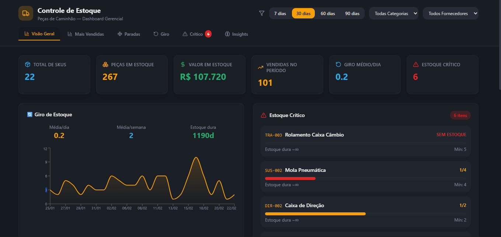
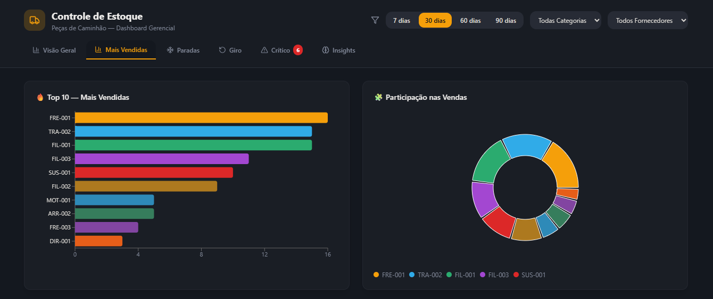
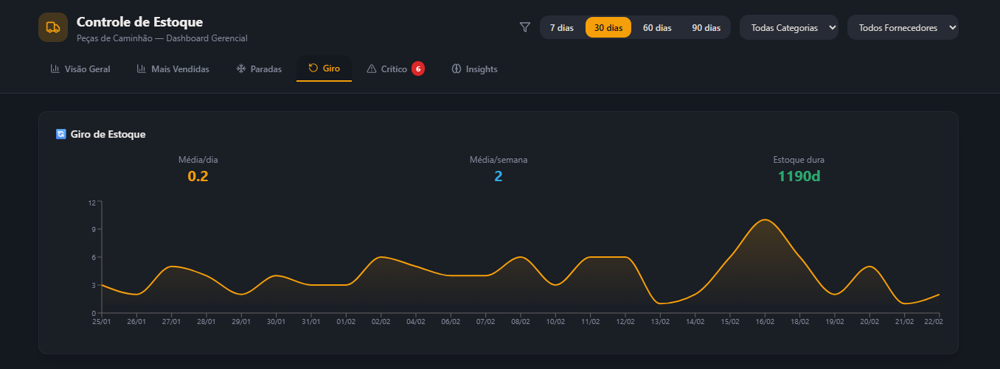

# 📦 Controle de Estoque Web

Sistema web moderno para gestão de estoque com dashboard analítico e visualização de indicadores estratégicos.

Projeto desenvolvido com foco em arquitetura front-end escalável, organização modular e experiência do usuário.

---

## 🚀 Demonstração





Em execução local via Vite:

```bash
npm install
npm run dev

Stack Tecnológica

⚛️ React 18

🟦 TypeScript

⚡ Vite

🎨 TailwindCSS

🧩 ShadCN UI

📊 Recharts

🔀 React Router DOM

📦 Radix UI

🧪 Vitest

📊 Funcionalidades

Dashboard com indicadores visuais

Visualização de métricas de estoque

Interface responsiva e moderna

Estrutura preparada para integração com API

Organização modular de componentes

Arquitetura pronta para expansão SaaS

🏗️ Arquitetura do Projeto

Estrutura organizada em:

src/
 ├── components/
 ├── pages/
 ├── routes/
 ├── hooks/
 ├── lib/
 └── assets/

 Padrões utilizados:

Componentização reutilizável

Separação de responsabilidades

Estrutura preparada para escalabilidade

Tipagem forte com TypeScript

Objetivo do Projeto

Este projeto foi desenvolvido com foco em:

Aplicação de boas práticas em front-end moderno

Estruturação de dashboard empresarial

Base para evolução para sistema ERP / SaaS

Preparação para integração com backend (FastAPI ou Node)

Próximas Evoluções

Integração com backend REST

Autenticação com JWT

Multi-tenant

Relatórios em PDF

Deploy em produção (Vercel)

Integração com banco de dados


Autor

Jonas Melo
Engenheiro de Dados | Desenvolvedor Full Stack em evolução

🔗 LinkedIn: www.linkedin.com/in/jonas-melo-ab233215b